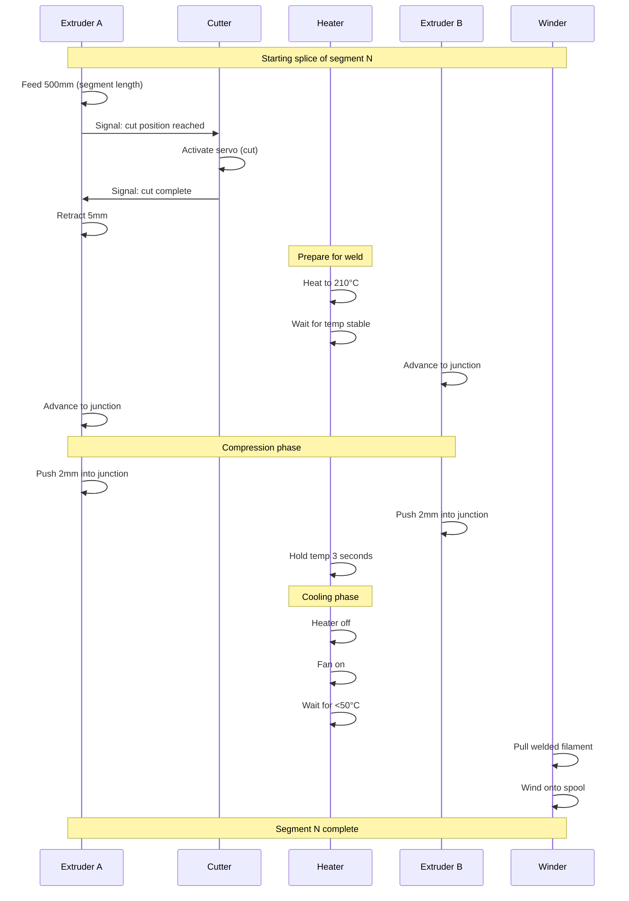

# Splice Core Design

> Based on Mosaic Palette research - the mechanism that welds filament together.

## How Commercial Systems Work (Mosaic Palette)

Research on the Mosaic Palette reveals these key parameters:

1. **Rotary Cutter** - Precisely severs filament to exact length
2. **Heat Factor** - Controls heating time in splice core
3. **Compression Factor** - Pressure applied during fusion
4. **Cooling Factor** - Duration of rapid cooling
5. **Scroll Wheel** - Measures filament length accurately

## Splice3D Implementation

### Splice Core Components

```
                    ┌─────────────────────┐
   Filament A ────► │     PTFE TUBE       │ ◄──── Filament B
                    │    (2mm ID x 30mm)  │
                    │                     │
                ┌───┤     HEAT BLOCK      ├───┐
                │   │    (from hotend)    │   │
                │   │   ┌───────────┐     │   │
   Heater ──────┤   │   │ JUNCTION  │     │   ├────── Thermistor
   Cartridge    │   │   │   ZONE    │     │   │
                │   │   └───────────┘     │   │
                └───┤                     ├───┘
                    │                     │
                    │    COOLING FAN      │
                    │        ↓            │
                    └─────────────────────┘
                             │
                             ▼
                      Welded Output
```

### Key Parameters (Tunable)

```cpp
// Splice parameters - adjust per material
struct SpliceProfile {
    const char* material;
    uint16_t temp_celsius;      // Splice temperature
    uint16_t heat_time_ms;      // Time at temperature
    float compression_mm;       // Push distance
    uint16_t cooling_time_ms;   // Fan cooling time
};

// Default profiles
SpliceProfile profiles[] = {
    {"PLA",  210, 3000, 2.0, 5000},
    {"PETG", 235, 3500, 2.5, 6000},
    {"ABS",  250, 4000, 2.5, 7000},
};
```

### Splice Cycle Sequence



### PTFE Tube Constraint

The key to consistent splice diameter is the PTFE tube:

```
Cross-section view:

    ┌─────────────────┐
    │                 │  ← PTFE outer (4mm OD)
    │   ┌─────────┐   │
    │   │░░░░░░░░░│   │  ← Molten junction (1.75mm)
    │   │░░░░░░░░░│   │
    │   └─────────┘   │
    │                 │  ← PTFE inner (2mm ID)
    └─────────────────┘

The 2mm ID PTFE constrains the molten plastic
to reform at 1.75mm diameter as it cools.
```

### Temperature Zones

```
Temperature along splice path:

  250°C ─┐
         │        ┌────┐
  200°C ─┤        │    │       ← Splice zone (heated)
         │    ┌───┘    └───┐
  150°C ─┤    │            │
         │    │            │
  100°C ─┤────┘            └──── ← Transition zones
         │
   50°C ─┤                       ← Heat break / cooling
         │
   25°C ─┴─────────────────────── ← Ambient
         Entry              Exit
```

### Heater Control Algorithm

Based on PID with overshoot protection:

```cpp
void controlHeater() {
    float current = getCurrentTemperature();
    float target = getTargetTemperature();
    
    // Approaching target - reduce power to avoid overshoot
    if (current > target - 10) {
        // Within 10°C - use PID
        updatePID();
    } else if (current < target - 50) {
        // Far from target - full power
        setHeaterPower(255);
    } else {
        // Getting close - 75% power
        setHeaterPower(192);
    }
    
    // Safety: thermal runaway check
    if (heatingTime > THERMAL_RUNAWAY_PERIOD) {
        if (tempChangeInPeriod < THERMAL_RUNAWAY_TEMP) {
            // Not heating fast enough - fault!
            emergencyStop("THERMAL_RUNAWAY");
        }
    }
}
```

### Splice Quality Indicators

**Good splice:**
- Diameter: 1.75mm ± 0.05mm
- No visible seam from outside
- Bends 90° without breaking
- Feeds through Bowden without catching

**Bad splice - too hot:**
- Bulge at junction (>1.85mm)
- Charred/discolored
- May jam in Bowden

**Bad splice - too cold:**
- Visible gap/seam
- Breaks when bent
- Weak under tension

**Bad splice - poor alignment:**
- Kinked at junction
- Offset cores
- Uneven diameter

### Tensile Strength Target

Good splices should withstand:
- **Minimum**: 20N (2kg pull force)
- **Target**: 30N (3kg) - close to virgin filament
- **Virgin PLA**: ~35-50N

Test procedure:
1. Cut 100mm sample with splice in center
2. Clamp both ends in tensile tester
3. Pull at 10mm/sec until break
4. Record peak force

### Troubleshooting

| Symptom | Cause | Fix |
|---------|-------|-----|
| Brittle splice | Too cold | Increase temp +10°C |
| Bulging splice | Too hot | Decrease temp -10°C |
| Weak splice | Short hold time | Increase hold +1s |
| Kinked splice | Misalignment | Check PTFE centering |
| Inconsistent | Temperature fluctuation | Tune PID, add insulation |
