# Splice3D - Complete Vision Document

> From simple filament splicer to fully automated print manufacturing.

## Vision Overview

```mermaid
graph TB
    subgraph "Phase 1: Core Splicer (Current)"
        A[G-code Parser] --> B[Splice Machine]
        B --> C[Pre-spliced Spool]
        C --> D[Manual Print]
    end
    
    subgraph "Phase 2: Position Tracking"
        E[Dimple Encoder] --> F[Position Tracking]
        G[Reusable Crimps] --> H[Print Boundaries]
    end
    
    subgraph "Phase 3: Dry Vault"
        I[Climate Control] --> J[Sealed Storage]
        J --> K[Automated Splicing]
    end
    
    subgraph "Phase 4: Print Farm"
        L[Order Queue] --> M[Bed Dispenser]
        M --> N[Failure Recovery]
        N --> O[Fulfillment]
    end
    
    subgraph "Phase 5: Vertical Integration"
        P[Raw Pellets] --> Q[Custom Filament]
        Q --> R[Full Pipeline]
    end
```



---

## New Concepts from Brainstorming

### 1. Mechanical Dimple Encoding (Position Tracking)

Instead of optical barcodes (which could affect color), emboss tiny dimples into the filament surface.

```
Side view of filament:
════════════════════  ← Smooth surface
══╝══╝╝══╝══╝╝╝════  ← Dimpled pattern (0.1-0.2mm deep)
  ↑  ↑ ↑ ↑  ↑ ↑ ↑
  Binary encoding
```

**Advantages:**
- No foreign materials added
- Doesn't affect color
- Rotation immune (multiple tracks around circumference)
- High resolution (data every millimeter)
- No heat sensitivity
- Very cheap (just mechanical process)

**Encoding Scheme:**
```
Every 10mm: ●●○●○
            ↑ ↑ ↑ ↑ ↑
            Incremental counter + error correction

At splice points:
●●●●○○●●○●●○○●●●
↑       ↑     ↑
Header  Data  Checksum
```

**Reading Methods:**
1. **Optical (Shadow Detection)** - LED + photodiode, dimples cast shadows
2. **Mechanical (Stylus)** - Spring-loaded pin rides surface
3. **Capacitive** - Dimples = less material = different capacitance

---

### 2. Reusable Crimp System

Instead of disposable RFID chips at every color change, use reusable NFC chips that are **ejected before the hotend** and returned to the vault.

```
┌─────────────────────────────────────────┐
│         DRY VAULT (Splicing)            │
│  1. Crimp retrieved from return bin     │
│  2. Data written to crimp chip          │
│  3. Crimped onto filament at boundary   │
└──────────────┬──────────────────────────┘
               ↓
┌──────────────────────────────────────────┐
│           PRINTER                        │
│  5. Crimp detected approaching           │
│  6. Data read from crimp                 │
│  7. CRIMP EJECTED before hotend          │
│  8. Falls into return chute              │
└──────────────┬───────────────────────────┘
               ↓
       [Return Conveyor] → Back to Vault
```

**Crimp Design:**
```
┌─────────────────┐
│   NFC Chip      │  ← Rewritable memory
│   + Antenna     │
├─────────────────┤
│  Hinge Clamp    │  ← Opens/closes
│  ═══╪═══╪═══    │  ← Grips filament
└─────────────────┘
```

**Economics:**
- 200 crimps @ $2-5 each = $400-1000 initial
- Each crimp: 10,000+ cycle lifespan
- Break-even vs disposable after ~1 day of operation

**Ejection Mechanism Options:**
1. Spring-loaded pin pushes crimp sideways
2. Rotating cam ejector
3. Pneumatic blast

---

### 3. Hybrid Tracking System

Combine dimples + crimps for best of both worlds:

```
[Continuous Dimples] ═══●═══●═══●═══●═══
                          
[Metal crimp at Print #1 start] ╪
[Dimples] ═══●═══●═══●═══●═══
[Metal crimp at Print #2 start] ╪
```

- **Dimples**: Fine position tracking ("you're at meter 47.384")
- **Crimps**: Print boundaries + rich metadata

For Starry Night Vase (4000+ color changes):
- Only ~1 crimp needed (print start)
- 4000 dimple-tracked segments
- Cost: essentially free

---

### 4. Dry Vault (Climate-Controlled Storage)

Sealed chamber containing all filament and splicing equipment.

```
┌─────────────────────────────────────┐
│   SEALED DRY VAULT (<10% RH)        │
│                                     │
│  ┌─────┐ ┌─────┐ ┌─────┐ ┌─────┐   │
│  │Spool│ │Spool│ │Spool│ │Spool│   │
│  └──┬──┘ └──┬──┘ └──┬──┘ └──┬──┘   │
│     └──────┬┴──────┴┴───────┘      │
│            ▼                       │
│      [Cutting Station]             │
│      [Dimple Encoder]              │
│      [Splicing Station]            │
│      [Crimp Applicator]            │
│      [Respooling Station]          │
│                                    │
│  [Dehumidifier] [Temp Control]     │
└─────────────────────────────────────┘
```

**Benefits:**
- Dry filament = stronger splices
- Consistent diameter = accurate tracking
- No random failures from moisture
- 24/7 unattended operation

---

### 5. Automated Print Farm (Pez Dispenser Beds)

Stack of 100+ removable print beds that auto-load/eject.

```
┌─────────────┐
│  Bed Stack  │ ← 100 fresh beds
│  ┌───────┐  │
│  │───────│  │
│  │───────│  │
│  │───────│  │
│  └───────┘  │
└──────┬──────┘
       ↓
┌──────────────────┐
│    PRINTER       │
│  [Active Bed]    │
└────────┬─────────┘
         ↓
┌──────────────────┐
│  SUCCESS BIN     │ → Fulfillment
├──────────────────┤
│  FAILURE BIN     │ → Analysis + Re-queue
└──────────────────┘
```

**Queue Integration:**
- Filament spool IS the physical queue
- Each print boundary marked with crimp
- Failures: mark position, re-queue that segment
- Notifications: "95/100 prints succeeded"

---

### 6. Failure Data Collection

Track everything for machine learning:
- Failure rates by filament vendor/batch/color
- Correlation with humidity, temperature, time
- Predictive maintenance
- Auto-generate purchase orders when spools low

```json
{
  "print_id": "ORDER-2847",
  "status": "FAILED",
  "failure_position_m": 52.7,
  "segment": 14,
  "material": "PLA_Matte_Blue",
  "vendor": "Bambu",
  "batch": "2025-Q4-1234",
  "ambient_humidity": 45,
  "vault_humidity": 8,
  "attempt_number": 1
}
```

---

### 7. Ultimate Test Case: Starry Night Vase

The perfect benchmark for the system:
- **4,068 filament changes**
- **7 colors**
- **Current waste: 67% (187m purge out of 277m total)**

With Splice3D:
- Pre-splice all segments
- Eliminate purge waste (only 10% buffer per splice)
- Single continuous feed
- Dimple tracking for position sync

**Link**: [MakerWorld Starry Night Vase](https://makerworld.com/en/models/2129520-starry-night-vase)

---

## Updated Roadmap Phases

### Phase 1: Core Splicer (Current) ✅
- G-code parser
- Basic splicing
- USB communication

### Phase 2: Position Tracking System
- [ ] Dimple encoder hardware
- [ ] Dimple reader (optical or mechanical)
- [ ] Position database
- [ ] Drift compensation algorithm

### Phase 3: Reusable Crimp System
- [ ] Crimp hardware design
- [ ] NFC read/write integration
- [ ] Ejector mechanism
- [ ] Return conveyor

### Phase 4: Dry Vault
- [ ] Sealed chamber design
- [ ] Active dehumidification
- [ ] Temperature control
- [ ] Environmental monitoring

### Phase 5: Automated Print Farm
- [ ] Bed dispenser mechanism
- [ ] Print success/failure detection
- [ ] Queue management software
- [ ] Order integration API

### Phase 6: Full Vertical Integration
- [ ] Pellet → filament extrusion
- [ ] Custom color mixing
- [ ] End-to-end automation
- [ ] Lights-out manufacturing

---

## Technical Questions to Resolve

1. **Dimple depth**: 0.1mm or 0.2mm? Need tensile testing.
2. **Dimple reading speed**: Can we read at 150mm/sec print speed?
3. **Crimp ejection**: Spring pin vs cam vs pneumatic?
4. **Vault size**: How many input spools? 7? 16?
5. **Bed dispenser**: Magnetic beds? Spring-loaded?

---

## Key Innovation Summary

| Problem | Traditional | Splice3D Solution |
|---------|-------------|-------------------|
| Color changes | Real-time tool swap | Pre-spliced continuous |
| Position drift | Stepper counting (inaccurate) | Dimple encoding |
| Metadata | None | Reusable NFC crimps |
| Filament moisture | Manual drying | Sealed vault |
| Multi-print queue | Manual intervention | Physical queue spool |
| Failure recovery | Start over | Re-queue segment |
